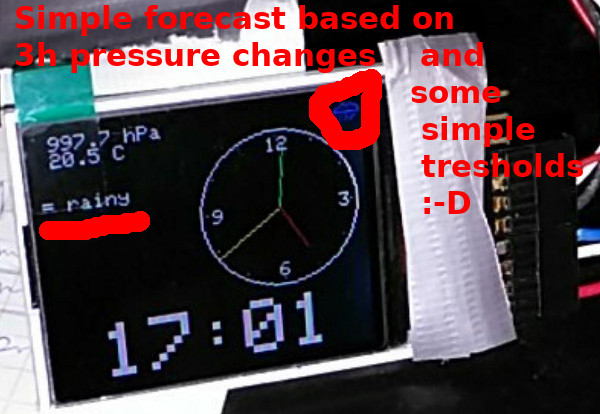
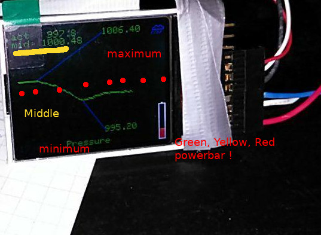
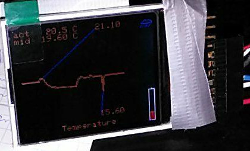

# WeatherFrog

display 24h log for BMP280 pressure and temperatur with simple clock, forecast on ST7735 TFT.

## Pictures

The code switches through 3 modes every 3sec in `tick()` the line `seconds%3 == 0`.

This is the Time-Mode. With button 1 `#define HOUR_BTN 8` and
button 2 `#define MINU_BTN 7` you can set the clock. It is not very
precise (5min to slow in 24h).

To reduce flickering, the text is reprinted without refresh. It looks
strange, if the actual pressure and temp changes.

Pressure- and Temperature-Mode. I map the pressure value from 940.0 to 1042.0
to 1 byte with an accurency of 1/4 hPa. I reuse the code to map the
temperature -25.0 to + 70.0 to a pressure value and store it as 1byte, too.
The code for map/remap is in `myHack.h`

I print the curve 2 times (x+1, y+1) to make it bold.

## Pictogram

I create some small pictograms for the weather. I did not use the
SD card slot of ST7735.

## 24h

The code adds every `#define STOREEVERY 12` minutes a value to the
array in `hpa` and `cel`. It stores `#define STOREAGE 120` values.

## PowerBar.h

This is cool code. It prints a small bar: green = full, yellow = 50%,
red = empty

## Forecast

It is not easy to make a weather forecast. on a see there is a easy
way to analyse the pressure. If the pressure grows up: A high pressure
area is coming with sun and vice versa.

~~~~cpp
  if ( (hpa0 - hpa1) > 1.0 ) {
    if ( (hpa0 - hpa3) > 3.3 ) {
      display.drawBitmap(x, y, pictogram[5], 16,10, CYAN);
      if(withText) display.print(F("sun+breezy"));
      return 5;
    }
    display.drawBitmap(x, y, pictogram[3], 16,10, CYAN);
    if(withText) display.print(F("+ sunny"));
    return 3;
  }
  
  if ( (hpa0 - hpa1) < -1.0 ) {
    if ( (hpa0 - hpa3) < -3.3 ) {
      display.drawBitmap(x, y, pictogram[0], 16,10, GREYBLUE);
      if(withText) display.print(F("rain+storm"));
      return 0;
    }
    display.drawBitmap(x, y, pictogram[1], 16,10, LIGHTBLUE);
    if(withText) display.print(F("+ clouds"));
    return 1;
  }
~~~~

But there is a other (stupid) code part:

| hPa     |    forecast |
|:--------|------------:|
| < 1009  |     = rainy |
| < 1013  |    = cloudy |
| < 1014.5| unsettled   |
| < 1016  |    = sunny  |
| >= 1016 |     = sun!  |

You see, it is not better than a frog in a glas!

## Wireing

Take a look at the `--- CONFIG ---` part in `wFrog.ino` file. There
are many hints!!

## Debuging

To make the logging a bit faster, look at `void tick()` function.
If you uncomment the `//dostore = true;` line, it stores a value every
second and not every 12 minutes. Because I did not refresh the TFT,
the curve gets bolder every second :-D
